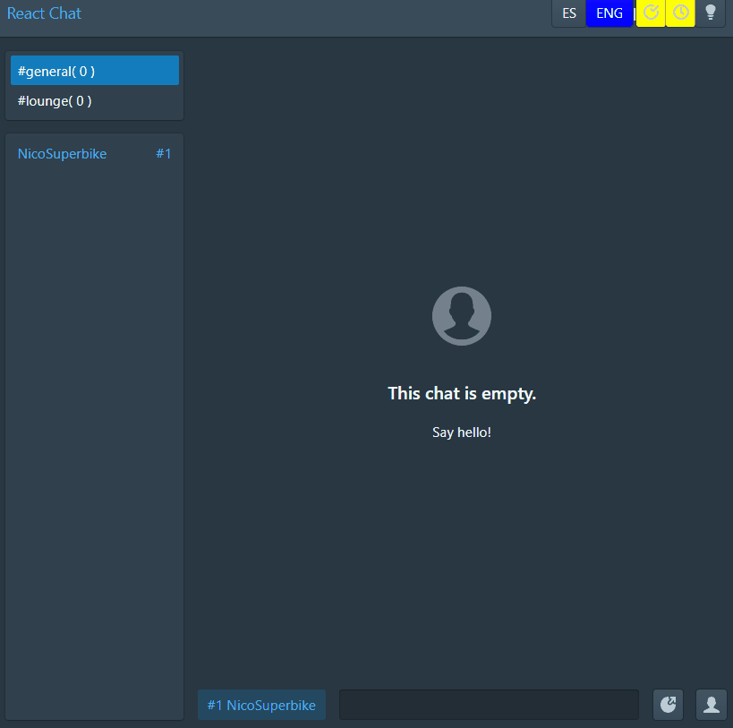

# TypeScript / React / NodeJS / SocketIO chat sample application

## Run

Run NodeJS server first:

    $ cd server
    $ cp config-sample.json config.json
    $ npm install
    $ npx tsc
    $ node dist/index.js

Client:

    $ cd client
    $ npm install
    $ npm start
	
## Features

* Link parser: supports embedded images and youtube links 
* Multiple channels 
* Different configuration parameters ( User name, Send on Enter, 24H hour time format )
* Light / dark theme 
* Internationalization
* Emojis

## TODO

* Unread messages counter for each channel

