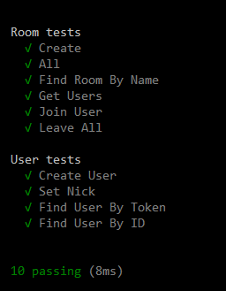

# TypeScript / React / NodeJS / SocketIO chat sample application

## Requirements

NodeJS / npm
TypeScript 2.9.2

## Run

Build and run NodeJS server first:

    $ cd server
    $ npm install
    $ npx tsc
    $ node dist/index.js

Client:

    $ cd client
    $ npm install
    $ npm start

## Testing

Mocha / Chai framework is used for testing and some basic test cases have been included. Run as follows:

    $ npm run-script test

## Running

When running client, using multiple clients should require them to be run from different devices as client token is stored using localStorage API
	
## Features

* Mobile friendly responsive UI
* Link parser: supports embedded images and YouTube links 
* Multiple channels 
* Different configuration parameters ( User name, Send on Enter, 24H hour time format )
* Light / dark theme 
* Internationalization
* Emojis

## TODO

* Unread messages counter for each channel (Redux version)
* Dark theme support on emojis panel
* Google authentication (partially completed)
* Better internationalization of the GUI (right now is only supported on chat events window, implemented as POC)
* Extend unit testing cases

